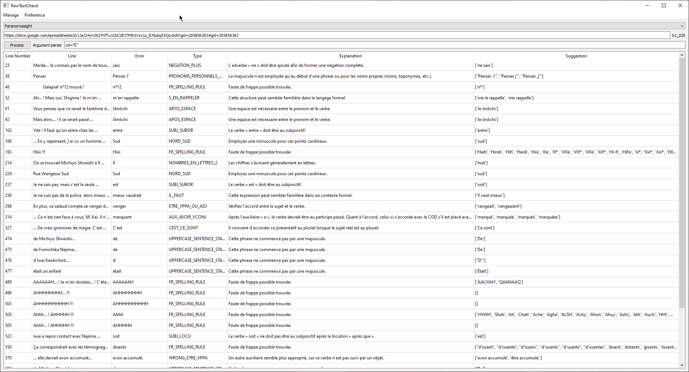
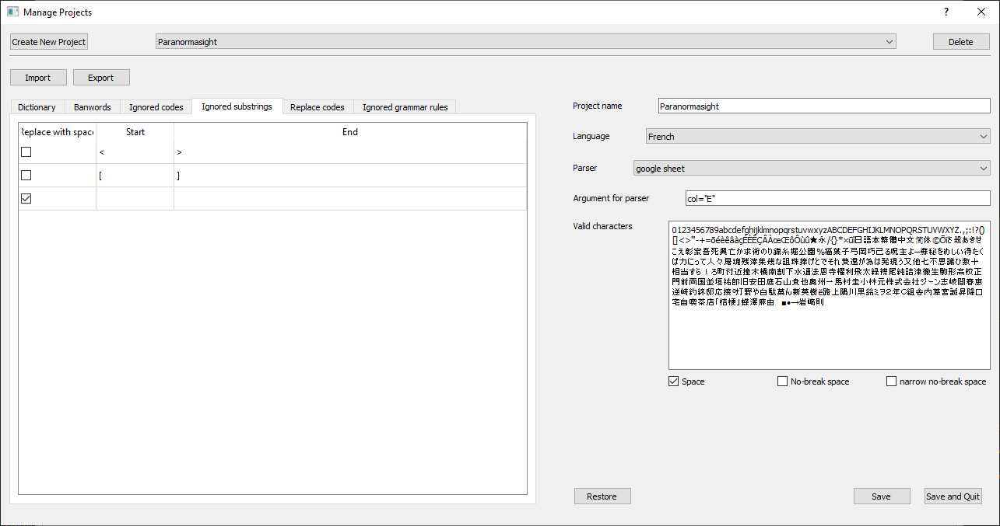

<div align="center">

# RawTextCheck

 software tool to proofread text in any file formats.

</div>

## Overview

RawTextCheck is a Python-based integration of LanguageTool, built with PyQt5. Its purpose is to proofread texts found in non-standard formats such as XML, Excel, CSV, JSON, and other structured files. These files often contain code elements, markup, or special characters that are not part of the actual text, but are essential for the logic or styling of scripts, especially in video games.

This tool was originally designed for fan translation of video games, but it can be adapted to many other use cases where structured text needs linguistic analysis.

To analyze a file, a parser first extracts the relevant text lines. Several generic parsers are already included, and custom parsers can be plugged in for specific formats. The parser itself doesn’t need to clean the text, as that can be handled by a dedicated filtering system afterward.

Each file is analyzed within the context of a project, which defines parameters such as:

- The language of the text
- A list of valid characters
- Words to flag as errors (e.g., banned words)
- Custom dictionary entries to ignore false positives
- Filters to exclude code fragments, either by defining specific tokens or start/end delimiters

RawTextCheck provides a flexible and extensible environment for proofreading structured text embedded in various formats, ensuring cleaner and more accurate translations or content validation.

## Documentation

### Main Window


- **Manage menu**:
    - **Configure project**: Opens the project management window. Use this to create your first project. ([Project configuration](#manage-project-window))
- **Preference menu**:
    - **Language**: Select the application language. The app must be restarted for changes to take effect. Note: This setting does not affect the language used for text analysis.
- **Project selection combo box**: Select which project to use for file analysis.
- **File path input**: Enter the path of the file to analyze. You can also drag and drop a file onto the app to fill this field automatically.
- **Argument parser**: Specify arguments for the parser. By default, the arguments defined in the project are used, but you can modify them for specific files if needed.
- **Process button**: Start the analysis of the selected file. Processing may take some time, please be patient. If LanguageTool is not yet initialized, analyzing a 500-line file may take 1–2 minutes.
- **Table**: Displays the analysis results. If a file has been analyzed previously, the most recent results will be loaded

### Interact with results

There are 6 columns:
- **Line Number**: The line in the file where the error was found, or the line's ID.
- **Line**: The text content of the line.
- **Error**: The word(s) where the error was detected.
- **Type**: The LanguageTool error type.
- **Explanation**: A description of the error.
- **Suggestion**: Suggested correction(s) for the error.

Each column can be hidden by right-clicking and deselecting it in the Visibility menu. Hidden columns will be remembered.

For each line, several actions are available by right-clicking on it:

- **Delete**: Delete the line. The delete key can also be used.
- **Add character to valid characters**: Only for invalid character errors. Adds the character to the project's valid characters and removes all errors related to this character.
- **Add this word to dictionary**: Only for spelling errors. Adds the word to the dictionary and removes all spelling errors for this word.
- **Remove word from the banword list**: Only for banword errors. Removes the word from the banword list and deletes all related banword errors.
- **Add {rule name} to ignored rules**: For all other errors. Adds the LanguageTool rule to the ignored rules and removes all errors associated.

### Manage Project Window



***Top Part***

- **Create New Project**: You need to specify a unique name, a language for analysis, and a parser. All settings can be changed at any time.
- **Project selection combo box**: Select a project to load and edit its parameters in the window.
- **Delete button**: Delete the currently selected project.
- **Import button**: Import a project configuration. This will overwrite the current project's settings except for its name.
- **Export button**: Export the configuration of the current project.

***Left Part (Table)***

- **Dictionary**: Words that will not generate spelling errors. You can manually add words, and also delete them either by right-clicking or with the delete key.
- **Banwords**: Words that will generate errors, even if they are correct in your language. You can manually add words, and also delete them either by right-clicking or with the delete key.
- **Ignored codes**: Codes in the text to filter out. These will either be removed or replaced by a space.

    If your line looks like this:

    ```
    That's [c4]Yoko Fukunaga[c0].[r]Good, at least I can remember that much.
    ```
    You can add [c4] and [c0] as ignored codes without checking the checkbox, and [r] with the checkbox checked to add a space.

    So your filtered line will look like this:

    ```
    That's Yoko Fukunaga. Good, at least I can remember that much.
    ```

- **Ignored substrings**: You can filter text using delimiters. This will be applied after Ignored codes.

    For this text:

    ```
    That's [c4]Yoko Fukunaga[c0].[r]Good, at least I can remember that much.
    ```

    Suppose that for this project, [r] is the only code where a space is needed, and other codes with [ ] do not need a space. So instead of adding [c4], [c0], and many others to Ignored codes, you can add [ as the start and ] as the end delimiter, without checking the checkbox, to filter everything starting with [ and ending with ]. The result will look the same:
    ```
    That's Yoko Fukunaga. Good, at least I can remember that much.
    ```

- **Ignored grammar rules**: LanguageTool rules to ignore. You can manually add rules, and also delete them either by right-clicking or with the delete key.