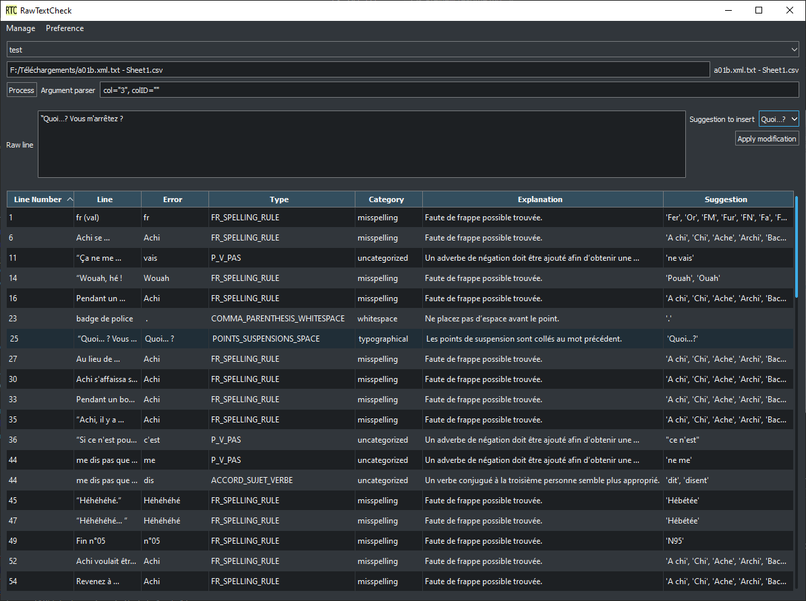
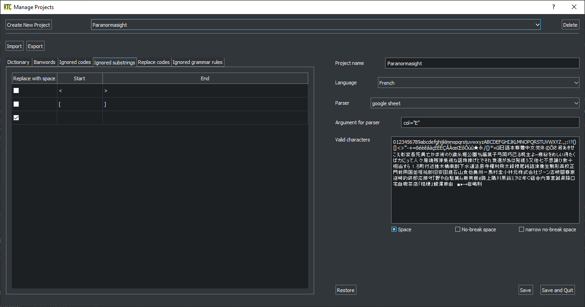

<div align="center">

# RawTextCheck

A software tool to proofread text in any file format.

</div>

---

## Overview

RawTextCheck is a Python-based integration of LanguageTool, built with PyQt5. Its purpose is to proofread texts found in non-standard formats such as XML, Excel, CSV, and other structured files. These files often contain code elements, markup, or special characters that are not part of the actual text, but are essential for the logic or styling of scripts — especially in video games.

This tool was originally designed for fan translation of video games, but can be adapted to many other use cases where structured text needs linguistic analysis.

To analyze a file, a parser first extracts the relevant text lines. Several generic parsers are already included, and custom parsers can be plugged in for specific formats. The parser itself does not need to clean the text, as that can be handled by a dedicated filtering system afterward.

Each file is analyzed within the context of a **project**, which defines parameters such as:

- The language of the text
- A list of valid characters
- Words to flag as errors (e.g., banned words)
- Custom dictionary entries to ignore false positives
- Filters to exclude code fragments, either by defining specific tokens or start/end delimiters
- Replacement of values with others

---

## ⚠️ Requirement

RawTextCheck (LanguageTool) requires [Java 17 or higher](https://adoptium.net/temurin/releases?version=21&os=any&arch=any) to run.

Make sure Java is installed and available in your system's `PATH` before using the tool.

---

## Development Setup

Create a virtual environment:
```bash
py -m venv venv
```

Activate it (PowerShell):
```bash
.\venv\Scripts\Activate.ps1
```

Install dependencies:
```bash
pip install -r requirements.txt
```

Run the project:
```bash
py -m rawtextcheck.main
```

Build the project:
```bash
pyinstaller rawtextcheck.spec
```

---

## Documentation

### Main Window



#### Menus

| Menu | Item | Description |
|------|------|-------------|
| **Manage** | Configure project | Opens the project management window. Use this to create your first project. ([Project configuration](#manage-project-window)) |
| **Manage** | Add google credentials | Add a Google API credentials file. Required for the Google Sheet parser. See [this guide](resources/credentials_google_api.md). |
| **Preference** | Language | Select the application language. The app must be restarted for changes to take effect. This does not affect the language used for text analysis. |
| **Preference** | Theme | Select the application theme. The app must be restarted for changes to take effect. |

#### Controls

- **Project selection**: Select which project to use for file analysis.
- **File path input**: Enter the path of the file to analyze. You can also drag and drop a file onto the app.
- **Argument parser**: Specify arguments for the parser. By default, the arguments defined in the project are used, but you can modify them for specific files if needed.
- **Process button**: Start the analysis. Processing may take some time. If LanguageTool is not yet initialized, analyzing a 500-line file may take 1–2 minutes.
- **Raw Line**: The raw line of the selected error. You can insert a suggestion or directly edit the line. Then, you can apply the correction with the button **Apply modification**. This feature can't be used with errors loaded from history. The process of the file need to be done just before.
- **Results table**: Displays the analysis results. If a file has been analyzed previously, the most recent results will be loaded automatically.

---

### Interact with Results

The results table has 6 columns:

| Column | Description |
|--------|-------------|
| **Line Number** | The line in the file where the error was found, or the line's ID |
| **Line** | The text content of the line |
| **Error** | The word(s) where the error was detected |
| **Type** | The LanguageTool error type |
| **Category** | The LanguageTool error category, useful for sorting |
| **Explanation** | A description of the error |
| **Suggestion** | Suggested correction(s) for the error |

Each column can be hidden by right-clicking and deselecting it in the **Visibility** menu. Hidden columns are remembered between sessions. Each column header can be clicked to sort errors.

#### Right-click Actions

| Action | Condition | Description |
|--------|-----------|-------------|
| **Delete** | Always | Delete the selected row. The `Delete` key can also be used. |
| **Copy text** | Always | Copy the cleaned text of the line column. |
| **Copy error** | Always | Copy the error. |
| **Copy suggestion** | When suggestions available | Copy the chosen suggestion. |
| **Add character to valid characters** | Invalid character errors only | Adds the character to valid characters and removes all related errors. |
| **Add this word to dictionary** | Spelling errors only | Adds the word to the dictionary and removes all related spelling errors. |
| **Remove word from the banword list** | Banword errors only | Removes the word from the banword list and deletes all related errors. |
| **Add {rule} to ignored rules** | All other errors | Adds the LanguageTool rule to ignored rules and removes all related errors. |

---

### Manage Project Window



#### Top Part

- **Create New Project**: Specify a unique name, a language for analysis, and a parser. All settings can be changed later.
- **Project selection**: Select a project to load and edit its parameters.
- **Delete**: Delete the currently selected project.
- **Import / Export**: Import or export a project configuration. Importing overwrites all settings except the project name.

#### Left Part — Filters

**Dictionary**
Words that will not generate spelling errors. Add words manually, or delete them via right-click or the `Delete` key.

**Banwords**
Words that will always generate errors, even if they are correct in your language.

**Ignored codes**
Codes in the text to filter out. These will either be removed or replaced by a space.

For example, given this line:
```
That's [c4]Yoko Fukunaga[c0].[r]Good, at least I can remember that much.
```
Adding `[c4]` and `[c0]` without the checkbox, and `[r]` with the checkbox checked, produces:
```
That's Yoko Fukunaga. Good, at least I can remember that much.
```

**Ignored substrings**
Filter text using start/end delimiters. Applied after Ignored codes.

Using the same example, instead of adding every `[xx]` code individually, you can add `[` as start and `]` as end delimiter (without checkbox) to filter all of them at once:
```
That's Yoko Fukunaga. Good, at least I can remember that much.
```

- You can keep "start" blank to remove the beginning of the line until "end" token.
- You can keep "end" blank to remove the end of the line from "start" token.

**Replace codes**
Define substitutions where specific tokens are automatically replaced with another value.

For example, given:
```
That$s Y#oko Fukunaga.
```
Setting `'` as replacement for `$` and `ō` as replacement for `#o` produces:
```
That's Yōko Fukunaga.
```

**Ignored grammar rules**
LanguageTool rules to ignore globally for this project.

#### Right Part — Project Settings

| Field | Description |
|-------|-------------|
| **Project name** | Change the name of the project |
| **Language** | Change the language used for LanguageTool analysis |
| **Parser** | Select which parser to use |
| **Argument for parser** | Default arguments for the parser |
| **Valid characters** | Authorized characters. Checkboxes available for the three common space characters |

Use **Restore** to revert unsaved changes, **Save** to save, or **Save and Quit** to save and close.

---

### Parsers

Arguments must be written in this format:
```
arg1="value", arg2="value", arg3='value'
```

Both single and double quotes are accepted.

There are 7 built-in parsers:

#### `textfile`

Returns every non-empty line in the file. Useful when Ignored codes, Ignored substrings, and Replace codes are sufficient to extract the sentences you need.

| Argument | Required | Description |
|----------|----------|-------------|
| `beginText` | No | Text to start parsing from. Ignored if `beginLineNumber` is set |
| `endText` | No | Text to stop parsing at. Ignored if `endLineNumber` is set |
| `beginLineNumber` | No | Line number to start parsing from |
| `endLineNumber` | No | Line number to stop parsing at |
| `contains` | No | Text each line must contain. Separate multiple values with `\|` |
| `notContains` | No | Text each line must not contain. Separate multiple values with `\|` |

#### `csv`

Returns every non-empty value from a specified column in a CSV file.

| Argument | Required | Description |
|----------|----------|-------------|
| `col` | **Yes** | Column number (1-based) |
| `colID` | No | Column to use as row identifier instead of line number |

#### `excel`

Returns every non-empty cell from a specified column in an Excel file.

| Argument | Required | Description |
|----------|----------|-------------|
| `col` | **Yes** | Column letter (e.g., `D`) |
| `colID` | No | Column letter to use as row identifier instead of row number |

#### `google sheet`

Returns every non-empty cell from a specified column in a Google Sheet. The file path must be the sheet URL. Credentials are required — see [this guide](resources/credentials_google_api.md).

| Argument | Required | Description |
|----------|----------|-------------|
| `col` | **Yes** | Column letter (e.g., `D`) |
| `colID` | No | Column letter to use as row identifier instead of row number |

#### `json`

Returns every non-empty value associated with a specified key, recursively across all objects in the JSON structure.

| Argument | Required | Description |
|----------|----------|-------------|
| `key` | **Yes** | The JSON key whose value to extract |
| `idKey` | No | Another key to use as row identifier instead of an auto-incremented index |

#### `pofile`

Returns every non-empty translation string (`msgstr`) from a PO file.

| Argument | Required | Description |
|----------|----------|-------------|
| `id` | No | Row identifier: `line` (default) uses the line number, `msgid` uses the source string |

#### `xml`

Returns non-empty text or attribute values from XML elements matching a given tag.

| Argument | Required | Description |
|----------|----------|-------------|
| `tag` | **Yes** | The XML element tag to extract |
| `attr` | No | Attribute name to extract instead of element text |
| `idAttr` | No | Attribute name to use as row identifier. Defaults to line number |

---

### Additional Parsers

If the built-in parsers are not sufficient, you can create your own.

A parser is a Python file implementing a specific interface. A template is available [here](https://github.com/Silous888/RawTextCheck-parsers/blob/main/template_parser.py). You can also start from any of the [default parsers](https://github.com/Silous888/RawTextCheck/tree/master/rawtextcheck/default_parser) as a base.

To add a parser, place the Python file in the `parsers` folder. The parser name will match the filename — avoid using the same name as any built-in parser.

> **Note:** All imports used by your parser must already be available in the RawTextCheck environment.

If your parser could be useful to others, consider sharing it in the [community parsers repository](https://github.com/Silous888/RawTextCheck-parsers).