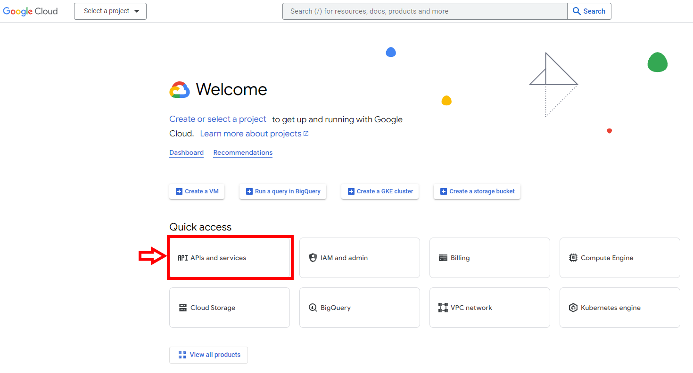
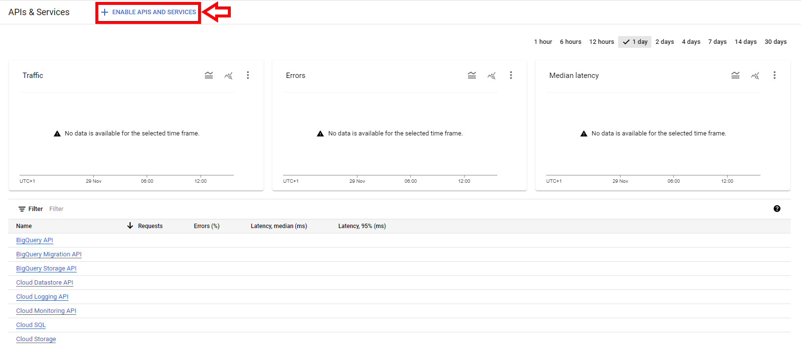
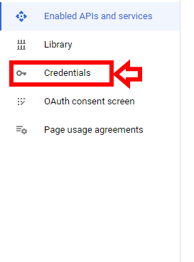
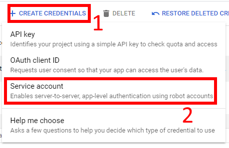
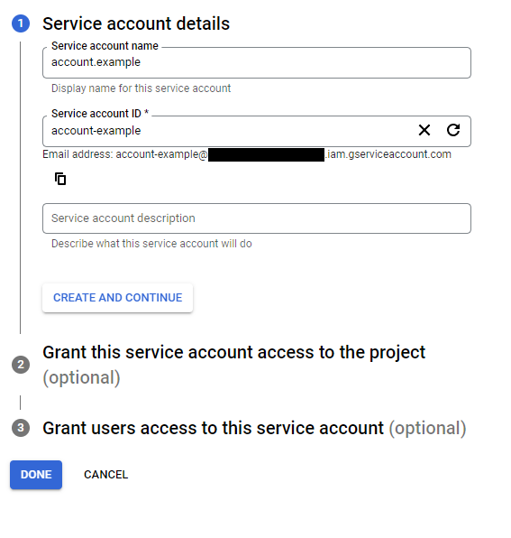
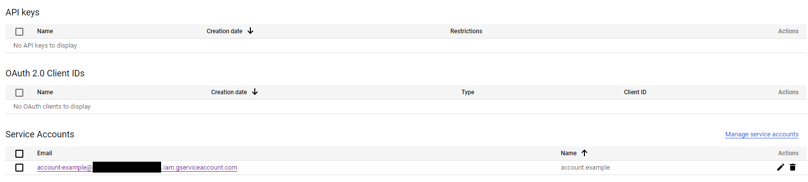
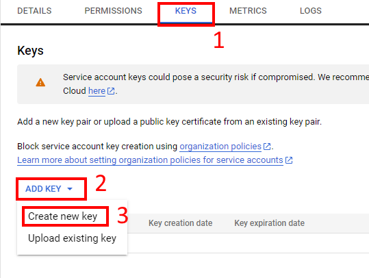
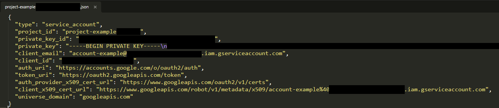

## get google API credentials

### How to get the credentials

You need a google account and to go to this link: https://console.cloud.google.com/.

You will land on a page similar to the one below, which may not be in english but everything should be identical. 
Go in **APIs and services**.

Next, in **ENABLE APIS AND SERVICES**, you need to create a project, where only a project name is required. Here the term "project" doesn't specifically refer to your individual project but rather serves as a global container where you can manage each of your service accounts, view API calls, etc.  
Subsequently, you will gain access to **ENABLE APIS AND SERVICES** now.
Enable the services you intend to use, likely Google Drive and possibly Google Sheets as well.

On the left side of the same page shown in the screenshot earlier, locate **Credentials** and click on it.

Then, click on **CREATE CREDENTIALS** and choose **Service account**.

Provide a name for your service account. The ID and email will be generated based on this name. 
For the *Grant this service account access to the project*, RawTextCheck doesn't need writing rights, but you can grant **Editor** or **Owner** access for other usage. 
There's no need to fill out the third part, you can simply click on **DONE**

Now, you should see your service account displayed. Click on it.

Navigate to the **KEYS** section. Then, click on **ADD KEY**, and choose to create a new key in **JSON** format. 
A json file should have been downloaded to your computer.

When you open the JSON file, it will look like this. You don't need to worry about the values.

Now, we can use this file. This file is the credentials file.

A service account works similarly to a regular account. If you want your service account to have access to a Google Drive, share this drive with the email of the service account.

